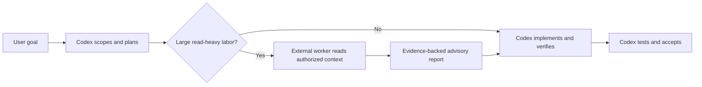

# external-subagents-mcp

> Spend inexpensive model tokens on reading. Keep Codex focused on judgment,
> implementation, and verification.

[](https://www.npmjs.com/package/external-subagents-mcp)
[](LICENSE)

[中文指南](docs/README.zh-CN.md) · [Complete configuration](docs/configuration.md) · [Changelog](CHANGELOG.md)

`external-subagents-mcp` gives Codex a provider-neutral, read-only external
worker pool. Lower-cost OpenAI-compatible models can search unfamiliar
repositories, read large source sets, summarize files, analyze logs, and
perform initial reviews without taking ownership of the project.

Codex remains the lead engineer. It understands the goal, plans the work,
chooses the implementation, edits files, runs commands and tests, verifies
evidence, and accepts the result. External workers provide bounded labor and
advice.

## The Division Of Labor

| Codex owns | External workers handle |
|---|---|
| Goals, architecture, planning, and trade-offs | Repetitive search and file discovery |
| Implementation decisions and file edits | Large-context reading and summarization |
| Shell commands, tests, approvals, and releases | Log analysis and initial code review |
| Evidence verification and final acceptance | Focused, read-only workspace exploration |



External workers never receive edit, shell, package-install, migration, or test
tools. They are a labor pool, not replacement project owners.

## Why Use It?

- **Delegate early, not only at review time.** Codex can offload repository
  exploration before consuming large amounts of main-model context.
- **Route work by cost and quality.** Use one provider for everything or assign
  different models to exploration, summaries, review, logs, and file finding.
- **Keep authority with Codex.** External output is advisory and must be
  verified before implementation.
- **Control what leaves the machine.** Workspace allow/deny rules, file-size
  limits, direct project authorization, and symlink containment bound access.
- **See what happened.** Jobs expose provider routing, external-call state,
  usage when available, cache hits, recovery mode, and exploration telemetry.
- **Recover useful work.** Malformed or truncated provider output is
  progressively repaired or salvaged instead of being discarded immediately.

The server reports external-provider usage when available. It does not claim
exact Codex token savings because Codex does not expose reliable per-tool
main-model token accounting.

## Five-Minute Setup

Requires Node.js 20.3 or newer.

### 1. Install And Authorize A Project

Run `init` from the root of the project external workers may read:

```bash
npm install -g external-subagents-mcp
cd /path/to/your-project
external-subagents-mcp init
```

This creates `.external-subagents-mcp.json`. The file defines allowed paths and
also acts as the explicit authorization marker for cross-project delegation.

### 2. Configure One Provider

Edit the generated config and point `standard` at any OpenAI-compatible chat
completions endpoint:

```json
{
  "providers": {
    "standard": {
      "base_url": "https://your-provider.example/v1",
      "api_key_env": "EXTERNAL_SUBAGENTS_STANDARD_API_KEY",
      "model": "your-model-name"
    }
  }
}
```

`api_key_env` is the name of an environment variable, never the secret itself.

```bash
export EXTERNAL_SUBAGENTS_STANDARD_API_KEY="your-api-key"
```

Only providers actually selected by active routing require a key. See the
[complete configuration guide](docs/configuration.md) for persistent
environment-variable setup, endpoint compatibility, profiles, automatic
routing, workspace policy, and every supported field.

### 3. Connect Codex

Add the MCP server to `~/.codex/config.toml`:

```toml
[mcp_servers.external_subagents]
command = "npx"
args = ["-y", "external-subagents-mcp"]
env_vars = [
  "EXTERNAL_SUBAGENTS_STANDARD_API_KEY",
  "EXTERNAL_SUBAGENTS_CONFIG"
]
startup_timeout_sec = 20
tool_timeout_sec = 300
```

`env_vars` contains variable names only. Restart Codex after changing its
configuration or persistent environment variables.

### 4. Teach Codex To Delegate Early

```bash
external-subagents-mcp install-codex-instructions
```

This safely installs a maintained block in `~/.codex/instructions.md` that
encourages an early delegation check before large source reads while keeping
planning, implementation, and acceptance with Codex.

Preview it first with:

```bash
external-subagents-mcp codex-instructions
external-subagents-mcp install-codex-instructions --dry-run
```

### 5. Verify The Setup

```bash
external-subagents-mcp doctor
external-subagents-mcp smoke --provider standard
```

`doctor` reports routing and missing keys without printing secrets. `smoke`
sends one small request to verify the selected endpoint, key, model, and report
format.

## Choose The Right Worker

Every task tool starts an asynchronous job. Use `delegate_wait`, then
`delegate_result`, to retrieve the completed structured report.

| Need | Tool |
|---|---|
| Investigate an unfamiliar workspace through iterative search and reads | `delegate_explore_workspace` |
| Summarize or compress files whose paths are already known | `delegate_summarize_paths` |
| Perform an initial review of known code or a supplied diff | `delegate_review_diff` |
| Rank relevant candidates from allowed file paths | `delegate_find_relevant_files` |
| Analyze a known log file or supplied log text | `delegate_analyze_log` |
| Inspect routing and API-key readiness | `delegate_provider_status` |
| Test one provider connection | `delegate_provider_smoke` |
| Wait, retrieve, inspect, or cancel jobs | `delegate_wait`, `delegate_result`, `delegate_status`, `delegate_cancel` |

Use the explorer when the question is focused but relevant files and
relationships are not yet known. It exposes only bounded `list_files`,
`search_text`, `read_file`, and `read_file_range` operations and requires a
provider with OpenAI-compatible tool calling.

When paths are known, prefer the narrower task tool. It usually costs fewer
provider turns and makes the result easier for Codex to verify.

## Route Models By Role

A profile maps five roles to configured providers:

| Role | Typical work |
|---|---|
| `explorer` | Multi-turn investigation of unfamiliar code |
| `summarizer` | Large known-file compression |
| `reviewer` | Initial code and diff review |
| `log_analyst` | Failure and log analysis |
| `file_finder` | Cheap candidate-file ranking |

The generated config includes three example strategies:

| Profile | Strategy |
|---|---|
| `single_provider` | One provider handles every role |
| `cost_first` | Lower-cost provider for routine labor; stronger reviewer |
| `quality_first` | Stronger provider for exploration and analysis |

Switch strategies with one line:

```json
{
  "routing": {
    "profile": "cost_first"
  }
}
```

Existing configs without an explicit `explorer` role remain valid; the server
derives it from `file_finder`, then `summarizer`, then the first configured
role. Profiles, automatic routing, and dynamic output budgets are documented in
the [complete configuration guide](docs/configuration.md).

## Safety And Trust

- All delegated task tools are read-only.
- Deny rules override allow rules.
- Default deny rules block environment files, dependencies, build output,
  credentials, certificates, archives, binary media, PDFs, and Git internals.
- Symlinks cannot escape the authorized workspace.
- Cross-project delegation requires `.external-subagents-mcp.json` directly in
  the requested root.
- API keys are read from environment variables only.
- Cache stores hashes, metadata, telemetry, and model reports, not raw source.
- Workspace content is treated as untrusted data in provider prompts.
- Authorized source and logs are sent to the provider you configure and remain
  subject to that provider's data policy.
- External reports are advisory. Codex must verify important evidence before
  changing code.

## Observable Delegation

Job records make external work inspectable:

- `externalApiCalled`: whether this request contacted a provider
- `usage`: provider-reported prompt, completion, and total tokens
- `cacheHit`: whether a previous result was reused
- `recovery`: strict, repaired, salvaged, text-fallback, or raw-fallback parsing
- `exploration`: turns, tool calls, files read, source bytes, search matches,
  and limits reached
- `workspaceRoot`, `inputBytes`, provider, route, elapsed time, and output budget

For explorer jobs, `inputBytes` covers the initial task prompt while
`exploration.sourceBytesRead` records source read during the tool loop.

## Documentation

- [Complete configuration guide](docs/configuration.md)
- [中文使用指南](docs/README.zh-CN.md)
- [Changelog](CHANGELOG.md)
- [Codex-led worker-pool design](docs/superpowers/specs/2026-06-14-codex-led-worker-pool-design.md)

## Project Status

The npm release is currently `0.2.1`. The `main` branch contains the upcoming
`0.3.0` Codex-led worker-pool work; see the [changelog](CHANGELOG.md) for its
unreleased capabilities.

## License

[MIT](LICENSE)
