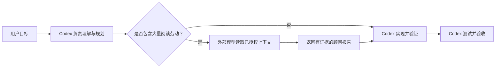

# external-subagents-mcp 中文指南

> 用低成本模型 Token 承担阅读劳动，让 Codex 专注判断、实现与验收。

[English README](../README.md) · [完整配置参考](configuration.md) · [更新日志](../CHANGELOG.md)

`external-subagents-mcp` 为 Codex 提供一个与厂商无关、严格只读的外部劳动力池。你可以让价格较低的 OpenAI-compatible 模型承担陌生项目搜索、大段源码阅读、文件摘要、日志分析和初步审查，而不把项目负责人身份交给它们。

Codex 始终是主负责人：理解目标、规划任务、选择实现方案、编辑文件、运行命令与测试、验证证据并最终验收。外部模型只执行有界、可复核的阅读劳动，并返回顾问性质的报告。

## 职责边界

| Codex 负责 | 外部劳动力池负责 |
|---|---|
| 理解目标、架构、规划和取舍 | 重复搜索与文件定位 |
| 实现方案、代码编辑和命令执行 | 大上下文源码阅读与摘要 |
| 测试、审批、发布和最终验收 | 日志分析与初步代码审查 |
| 验证外部报告中的关键证据 | 聚焦、只读的 workspace 探索 |



外部模型不会获得编辑、shell、安装依赖、迁移、测试或发布工具。它们是劳动力池，不是项目负责人。

## 为什么使用它

- **从任务早期开始委托。** Codex 可以在自己吞入大量源码前，将陌生项目探索交给外部模型，而不是只在最后做审查时才调用。
- **按成本与能力分工。** 可以只配置一个模型，也可以把探索、摘要、审查、日志和文件定位分配给不同模型。
- **保留 Codex 的决策权。** 外部输出仅供参考，实施前必须由 Codex 验证。
- **控制哪些内容可以离开本机。** allow/deny、文件大小限制、项目授权标记和符号链接边界共同限制读取范围。
- **能看见调用发生了什么。** Job 会显示 provider、是否真正调用外部 API、usage、缓存、报告恢复模式和探索遥测。
- **尽量抢救不完美输出。** 第三方模型返回损坏或截断 JSON 时，服务器会尝试修复和提取仍可用的部分。

服务器会记录 provider 返回的外部 API usage，但不会声称精确节省了多少 Codex Token，因为 Codex 不提供可靠的单工具主模型 Token 统计。

## 五分钟安装

需要 Node.js 20.3 或更高版本。

### 1. 安装并授权项目

进入允许外部模型读取的项目根目录：

```bash
npm install -g external-subagents-mcp
cd /你的项目/实际路径
external-subagents-mcp init
```

`init` 会在当前目录创建 `.external-subagents-mcp.json`。这个文件既定义允许读取的路径，也是跨项目委托时的显式授权标记；已有配置不会被覆盖。

### 2. 配置一个 Provider

打开生成的 `.external-subagents-mcp.json`，将 `standard` 指向任意 OpenAI-compatible chat completions API：

```json
{
  "providers": {
    "standard": {
      "base_url": "https://your-provider.example/v1",
      "api_key_env": "EXTERNAL_SUBAGENTS_STANDARD_API_KEY",
      "model": "your-model-name"
    }
  }
}
```

- `base_url`：从 provider 官方文档或控制台获取的 API 基础地址
- `model`：provider 使用的模型 ID
- `api_key_env`：保存 API Key 的环境变量名称，不是密钥本身

不要把 API Key 写进项目配置。

### 3. 设置 API Key 环境变量

当前 macOS/Linux 终端临时使用：

```bash
export EXTERNAL_SUBAGENTS_STANDARD_API_KEY="your-api-key"
```

持久设置时，建议把密钥放在项目之外：

```bash
mkdir -p ~/.config/external-subagents-mcp
chmod 700 ~/.config/external-subagents-mcp
${EDITOR:-nano} ~/.config/external-subagents-mcp/env
```

在打开的文件中填写实际使用的变量：

```bash
export EXTERNAL_SUBAGENTS_STANDARD_API_KEY="your-api-key"
export EXTERNAL_SUBAGENTS_LITE_API_KEY="your-api-key"
export EXTERNAL_SUBAGENTS_PRO_API_KEY="your-api-key"
```

随后保护并加载：

```bash
chmod 600 ~/.config/external-subagents-mcp/env
echo 'source "$HOME/.config/external-subagents-mcp/env"' >> ~/.zshrc
source ~/.zshrc
```

使用 Bash 时，将 `~/.zshrc` 替换为 `~/.bashrc`。Windows PowerShell 可设置用户级环境变量：

```powershell
[Environment]::SetEnvironmentVariable(
  "EXTERNAL_SUBAGENTS_STANDARD_API_KEY",
  "your-api-key",
  "User"
)
```

只需设置活跃路由实际会使用的 provider。未使用 provider 缺少 Key 不会阻止服务器启动。

### 4. 接入 Codex

在 macOS/Linux 的 `~/.codex/config.toml`，或 Windows 的 `%USERPROFILE%\.codex\config.toml` 中加入：

```toml
[mcp_servers.external_subagents]
command = "npx"
args = ["-y", "external-subagents-mcp"]
env_vars = [
  "EXTERNAL_SUBAGENTS_STANDARD_API_KEY",
  "EXTERNAL_SUBAGENTS_CONFIG"
]
startup_timeout_sec = 20
tool_timeout_sec = 300
```

`env_vars` 只填写环境变量名称，绝不能填写密钥值。修改 Codex 配置或持久环境变量后需要重启 Codex。

### 5. 让 Codex 更早考虑委托

```bash
external-subagents-mcp install-codex-instructions
```

该命令会在保留其他用户规则的前提下，安全新增或更新 `~/.codex/instructions.md` 中的受管区块。它会提示 Codex 在大规模读取源码前先判断是否适合委托，同时明确架构、实现、编辑、测试和验收仍由 Codex 负责。

预览和 dry-run：

```bash
external-subagents-mcp codex-instructions
external-subagents-mcp install-codex-instructions --dry-run
```

### 6. 验证配置

```bash
external-subagents-mcp doctor
external-subagents-mcp smoke --provider standard
```

`doctor` 会显示当前路由、缺失 Key、模型和最终请求地址，但不会打印密钥。`smoke` 会发送一个很小的请求，用于确认 endpoint、Key、模型 ID 和报告格式。

## 完整配置在哪里

这份中文指南覆盖常见安装与使用流程。所有字段级说明统一维护在：

**[完整配置参考：docs/configuration.md](configuration.md)**

其中包括：

- 配置文件查找顺序
- Provider endpoint 兼容与 `chat_completions_path`
- macOS、Linux、Windows API Key 环境变量
- Codex MCP 配置
- roles、profiles、自动路由和动态 output budget
- workspace allow/deny、安全上限和跨项目授权
- cache、并发、explorer 限制
- diagnostics 与故障排查
- 完整配置示例

当 README 或本指南中的简化示例不足以覆盖你的场景时，以完整配置参考和当前源码行为为准。

## 如何选择工具

所有任务工具都会返回异步 job。调用任务工具后，使用 `delegate_wait` 等待，再用 `delegate_result` 获取完整结构化报告。

| 任务 | 工具 |
|---|---|
| 在陌生项目中反复搜索、读取并回答聚焦问题 | `delegate_explore_workspace` |
| 已知文件路径，需要压缩或摘要 | `delegate_summarize_paths` |
| 对已知代码或 diff 做初步审查 | `delegate_review_diff` |
| 从允许访问的候选路径中排序相关文件 | `delegate_find_relevant_files` |
| 分析已知日志文件或传入的日志文本 | `delegate_analyze_log` |
| 检查 provider 路由和 API Key 状态 | `delegate_provider_status` |
| 测试单个 provider | `delegate_provider_smoke` |
| 等待、获取、查看或取消 job | `delegate_wait`、`delegate_result`、`delegate_status`、`delegate_cancel` |

当问题明确、但答案位于哪些文件尚不清楚时，使用 `delegate_explore_workspace`。Explorer 只开放有界的 `list_files`、`search_text`、`read_file` 和 `read_file_range`，并要求 provider 支持 OpenAI-compatible tool calling。

路径已经明确时，优先使用更窄的已知路径工具。它们通常需要更少的 provider 轮次，也更容易让 Codex 验证。

## Profiles：按角色分配模型

系统包含五个任务角色：

| 角色 | 典型任务 |
|---|---|
| `explorer` | 对陌生代码进行多轮只读探索 |
| `summarizer` | 压缩大量已知文件 |
| `reviewer` | 初步代码与 diff 审查 |
| `log_analyst` | 日志和失败分析 |
| `file_finder` | 低成本候选文件排序 |

生成的配置提供三种示例策略：

| Profile | 策略 |
|---|---|
| `single_provider` | 一个 provider 承担所有角色 |
| `cost_first` | 日常劳动使用低成本 provider，审查使用更强模型 |
| `quality_first` | 探索与分析使用更强模型 |

切换活跃方案只需修改一行：

```json
{
  "routing": {
    "profile": "cost_first"
  }
}
```

旧配置没有显式填写 `explorer` 也仍然有效。服务器会依次从 `file_finder`、`summarizer`、第一个已配置角色继承。

自定义 profiles、`routing.mode = "auto"`、`auto_rules` 和 `budget_rules` 请查看[完整配置参考](configuration.md)。

## 跨项目路径委托

Codex 应优先传递文件路径，而不是把大段源码复制进工具调用。目标项目不是 MCP 默认 workspace 时，可以传入绝对路径：

```json
{
  "workspace_root": "/项目的绝对路径",
  "paths": ["src/app.ts"],
  "focus": "公共 API 与关键依赖"
}
```

目标根目录必须直接包含 `.external-subagents-mcp.json`。目标配置的 `workspace` 段控制允许读取的文件，但不能改变运行中服务器的 providers、API Keys、路由、并发或缓存。

## 安全与信任边界

- 所有任务工具只读，不运行 shell、不编辑文件、不应用补丁、不执行迁移、格式化或测试。
- deny 规则始终优先于 allow。
- 生成的配置默认阻止 `.env`、依赖目录、构建产物、Git 内部文件、密钥、证书、归档、图片和 PDF。
- 二进制文件会被拒绝，符号链接不可逃逸 workspace。
- 跨项目读取要求目标根目录直接存在授权配置。
- API Key 只从环境变量读取。
- Cache 保存哈希、元数据、遥测和模型报告，不保存原始源码。
- Provider prompt 会把源码和日志视为不可信数据。
- 允许读取的源码与日志会发送给你配置的第三方 provider，并受其数据政策约束。
- 外部报告仅供参考；Codex 编辑前必须验证关键证据。

## 调用与 Token 可观察性

Job 记录会显示：

- `externalApiCalled`：本次是否真正调用外部 API
- `usage`：provider 返回的 prompt、completion 和总 Token
- `cacheHit`：是否复用了历史结果
- `recovery`：严格解析、修复、抢救、文本降级或原始建议降级
- `exploration`：轮次、工具调用数、读取文件数、源码字节数、搜索匹配数和触发限制
- provider、路由、耗时、workspace、初始输入字节和 output budget

Explorer job 的 `inputBytes` 只表示初始任务 prompt；工具循环读取的源码规模请查看 `exploration.sourceBytesRead`。

文件候选列表达到上限时会标记为 truncated 或写入 `omitted`，方便 Codex 判断外部模型看到的不是完整候选集。已完成 job 会在当前 server 进程中保留最近一批结果；长会话中过老的 job id 可能被清理。

缓存命中时 `externalApiCalled` 为 `false`。附带的 usage 和 exploration 是原始缓存任务的历史数据，不代表本次产生了新的 API 调用。

## 项目状态

当前发布版本为 `0.3.2`，主要修补长会话和大仓库稳定性：已完成 job 有了有界保留窗口，文件候选列表截断也会明确暴露给 Codex 和外部模型。具体变化请查看[更新日志](../CHANGELOG.md)。

## 许可证

[MIT](../LICENSE)
